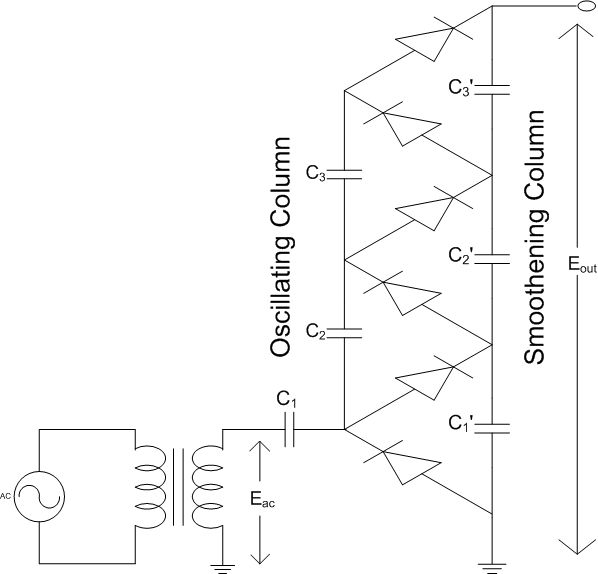

## Theory

#### Cockroft Walton Voltage Multipliers

High Voltage DC Multipliers are used to generate high DC Voltages using a single supply high voltage transformer. Cockroft and Walton popularized the use of multipliers using a multi-stage diode capacitor combination. A Three stage multiplier circuit is shown below:

#### Three Stage Voltage Multipliers
C1,C2,C2 constitute the oscillating column as the voltage across these capacitors vary with time,Whereas the capacitors C1',C2',C3' comprise the smoothening column since the DC Voltage output is fairly constant.

The DC Output voltage (Vdc) is nominally the twice the peak input voltage (Vmax) multiplied by the number of stages. Thus, for the circuit above a maximum voltage of Vdc= 3 * 2 * Vmax is possible. In practice, the DC output voltage is significantly lower, particularly when there are a large number of stages.

The multiplier circuits are popularly used in High Voltage DC power supply for particle accelerators. Multipliers are also used for charging capacitor banks to high voltages at roughly constant charging power. The downside of the multipliers is that the ripple and voltage drop on the output is high as the load current increases. The voltage regulation, is thus, poor at high loads.

#### Regulation and ripple calculations
Assuming all the stage capacitances to be equal, the voltage drop under load is given by :
Vdrop = Il/(f*C)*(2/3*n^3 + n^2/2 - n/6)

where:
Il is the load current
C is the stage capacitance
f is the AC frequency
n is the number of stages.
The ripple voltage, in the case where all stage capacitances (C1 through C(2*n)) may be calculated from:

Vripple = Il/(f * C)*n*(n+1)/2

As seen from this equation, the ripple increases as the square of the number of stages. A common modification to the design is to make the stage capacitances larger at the bottom, with C1 & C2 = nC, C3 & C4= (n-1)C, and so forth. Differentiating the drop equation with respect to the number of stages gives an equation for the optimum number of stages Nopt (for the equal valued capacitor design):

Nopt =√(Vmax * f * C/Il)

Increasing the frequency can dramatically reduce the ripple, and the voltage drop under load.
